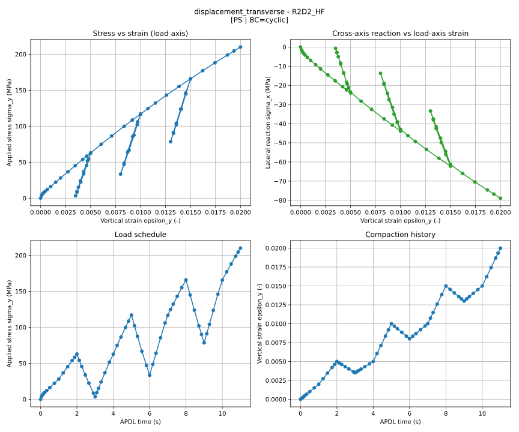

# LTS Rutherford Cable Workflow

End-to-end automated pipeline for **Nb<sub>3</sub>Sn LTS Rutherford-cable** simulation. From a one-line cable preset, one Python entry point produces the deformed strand cross-section after compaction, four cyclic stress-strain curves (displacement / pressure × transverse / radial), and -- optionally -- a per-strand Ic-degradation estimate under the measured BOX9 magnet load schedule.

The toolchain it stitches together: cable-parameter calculation → FreeCAD STEP → Ansys Mechanical mesh → LS-DYNA compaction → ParaView strand extraction → APDL conformal submodel → 4-stage MAPDL cablestack (2D plane-stress, matches an unconfined Zwick BC) → optional 3D compression-box magnetic coupling.

---

## What one run produces



For each cable, one run writes (under `data/runs/<timestamp>_<cable>/`):

- **Deformed strand mesh** (`stack/*.csv` from LS-DYNA → ParaView, plus a conformal APDL mesh under `APDL/submodel/apdl_runfolder/`).
- **Four cyclic stress-strain curves**, one per cablestack stage (displacement/pressure × transverse/radial), each as a `.txt` table and an SVG (`pp/<usecase>_stress_strain.txt` and `plots/<usecase>_subplots.svg`, like the image above).
- **`loading_cycle.json`** — the exact pressure / displacement schedule that was applied, plus the Nb<sub>3</sub>Sn modulus used (currently the 70 GPa standard; the RVE-homogenised override is in development).
- **`metadata.json`** — tool versions, per-stage workflow status, license server seen at run time.
- *(Opt-in step 9, compression box):* per-stack 3D magnetic field tables, one-turn submodel strains, and Ic-degradation CSVs/SVGs correlated against the measured BOX9 schedule.

---

## Quick start

### Containerised (recommended -- same on Linux, macOS, Windows)

```bash
docker build -t lts-cable .
docker run --rm \
    -v /var/run/docker.sock:/var/run/docker.sock \
    -v "$PWD/data:/app/data" \
    -e ANSYS_LICENSE_SERVER=1055@licenansys \
    -e REGISTRY_PREFIX=registry.cern.ch/chart-magnum \
    lts-cable -c R2D2_LF
```

The container bundles Python 3.12 + FreeCAD + ParaView and uses Docker-out-of-Docker via the mounted socket to spawn the Ansys Mechanical / LS-DYNA / MAPDL sibling containers on the host daemon.

### Native

```bash
git clone https://github.com/JoepVdE/LTS_Rutherford_Workflow_shared
cd LTS_Rutherford_Workflow_shared
pwsh tools/fetch_tools.ps1                          # Windows only -- SHA256-verified FreeCAD + ParaView download
pip install -e .[notebook]
export ANSYS_LICENSE_SERVER=1055@licenansys         # CERN; see "License servers" for ETH / PSI
export REGISTRY_PREFIX=registry.cern.ch/chart-magnum
lts-cable -c R2D2_LF
```

**Linux/macOS native:** install FreeCAD + ParaView from your package manager (`apt install freecad paraview`, `brew install --cask freecad paraview`); `tools/fetch_tools.ps1` is Windows-portable-bundles only.

**Windows PowerShell:** `$env:ANSYS_LICENSE_SERVER = "1055@licenansys"` instead of `export`.

`--list-cables` prints the three sample presets (`R2D2_LF`, `R2D2_HF`, `CD1`) -- each is a real Rutherford-cable spec runnable end-to-end with no further configuration.

---

## Requirements

### Software (host)

| Component | Version | Source |
|---|---|---|
| Python | 3.12 | python.org · Microsoft Store · `apt`/`brew` |
| Docker | Engine 24+ / Desktop 4+ | docker.com |
| Ansys 2025 R2 (v252) license | network-reachable FlexLM | institutional |
| FreeCAD | 1.0.2 (Windows) / apt-default (Linux) | `tools/fetch_tools.ps1` (Windows) · `apt install freecad` (Linux) · `brew install --cask freecad` (macOS) |
| ParaView | 6.0.1 (Windows) / apt-default (Linux) | `tools/fetch_tools.ps1` (Windows) · `apt install paraview` (Linux) · `brew install --cask paraview` (macOS) |

**Ansys is not installed on the host.** The Mechanical mesher, LS-DYNA solver, and MAPDL cablestack/compbox all run inside the `mechanical:25.2` and `lsdyna:25.2` Docker images, which ship Ansys internally. The host only needs Docker, pull access to the image registry, and FlexLM reachability.

### Docker images

| Image | Used for | Compose file |
|---|---|---|
| `<prefix>/mechanical:25.2` | Mesher (Ansys Mechanical) + MAPDL (cablestack + compbox) | `scripts/lsdyna/docker/docker-compose.yaml` · `scripts/apdl/docker/docker-compose.yaml` |
| `<prefix>/lsdyna:25.2` | LS-DYNA compaction solver | `scripts/lsdyna/docker/docker-compose.yaml` |

`<prefix>` is the `REGISTRY_PREFIX` env var. Default `gitea.psi.ch/vanden_j` (PSI); CERN users set `registry.cern.ch/chart-magnum`.

### Python dependencies

Managed by `pyproject.toml`: `ansys-mechanical-core`, `ansys-dyna-core==0.9.0`, `alphashape`, `matplotlib`, `networkx`, `numpy`, `pandas`, `python-pptx`, `scipy`, `shapely`. Install with `pip install -e .` (add `[notebook]` for JupyterLab + ipywidgets).

---

## License servers

The pipeline auto-detects which Ansys FlexLM server is reachable on the network it's started from. Built-in candidates:

| Institute | FlexLM string |
|---|---|
| CERN | `1055@licenansys` |
| ETH | `1801@lic-ansys-research.ethz.ch` |
| PSI | `1055@winlic03.psi.ch` |

(`1055@lxlicen01.cern.ch` is kept in the candidate list as a fallback for older CERN configurations.)

**Override** by exporting `ANSYS_LICENSE_SERVER` to a verbatim FlexLM string (`host:port` or comma-list for failover). The pipeline propagates the value into the LS-DYNA and MAPDL container environments as both `ANSYSLI_SERVERS` and `ANSYSLMD_LICENSE_FILE`.

```bash
# Linux / macOS
export ANSYS_LICENSE_SERVER=1055@licenansys
# Combine for failover:
export ANSYS_LICENSE_SERVER="1055@licenansys:1801@lic-ansys-research.ethz.ch"
```

---

## Configuration

Cable presets and cablestack settings live in [scripts/main/cable_parameters_user.json](scripts/main/cable_parameters_user.json). The three sample cables ship ready-to-run:

| Preset | Notes |
|---|---|
| `R2D2_LF` | Low-field R2D2 cable (default) |
| `R2D2_HF` | High-field R2D2 cable |
| `CD1` | CD1 cable |

Select a preset with `-c <NAME>` on the CLI, or by editing `active_cable`. Each preset includes wire material (Nb<sub>3</sub>Sn / Cu bilinear plasticity), strand count, pitch, diameters, and cablestack solve settings.

Key fields (see the file for the full set with inline `_comment_*` docs):

```jsonc
{
  "active_cable": "R2D2_LF",
  "cablestack": {
    "impreg":   4,            // 1=epoxy RT, 2=wax RT, 3=epoxy LN2, 4=wax LN2
    "bc_type":  "cyclic",     // 'cyclic' or 'linear' (displacement_transverse only)
    "boundary_type": "constrained",   // or 'free' for unconfined Zwick BC
    "stages": [
      "displacement_transverse",
      "displacement_radial",
      "pressure_transverse",
      "pressure_radial"
    ],
    "mesh_size_um":        50,    // impreg+insulation, ref at D_strand=0.85 mm
    "strand_mesh_size_um": 50,    // strand areas,      ref at D_strand=0.85 mm
    "pressure": {                 // applied to BOTH pressure stages
      "gauge_length_mm": 15.0,
      "peak_force_N":    45000,
      "min_force_N":     200,
      "ramp_pressures_MPa": [50.0, 100.0, 150.0]
    }
  }
}
```

---

## CLI flags

```bash
# Native (any OS, after pip install -e .):
lts-cable [OPTIONS]
# Equivalent direct call:
python scripts/main/main.py [OPTIONS]
# Containerised:
docker run --rm \
    -v /var/run/docker.sock:/var/run/docker.sock \
    -v "$PWD/data:/app/data" \
    -e ANSYS_LICENSE_SERVER=$ANSYS_LICENSE_SERVER \
    lts-cable [OPTIONS]
```

| Flag | Purpose |
|------|---------|
| `-c {R2D2_LF\|R2D2_HF\|CD1}` | Cable preset (default `R2D2_LF`) |
| `--cables <NAME> [NAME ...]` | Run multiple cables in parallel (one subprocess each) |
| `-t <ms>` | LS-DYNA termination time (default `0.0001`) |
| `--apdl-only` | Copy latest run → new `*_apdl_rerun/` folder; re-run d3plot→APDL + cablestack |
| `--quick-run` | Skip geometry + meshing; redo mesh-conversion + LS-DYNA |
| `--no-cablestack` | Generate cablestack `.inp` files but **do not launch any MAPDL stages** |
| `--hpc` | Run cablestack on an SSH-reachable SLURM cluster (upload + sbatch + wait + fetch). Default target ETH Euler; override via `HPC_HOST` / `HPC_USER` / `HPC_REMOTE_BASE` |
| `--debug-plots` | Per-pair conformal-mesh / outer-node SVGs (slow) |
| `--compbox` | Run the compression-box simulation (step 9) after cablestack, even if `compression_box.enabled` is false |
| `--compbox-only` | Run only the compression box on the latest run for the selected cable (add `--hpc` to solve on the cluster) |
| `--list-cables` | Print presets and exit |
| `--no-cache` | Force a fresh run from STEP geometry onward, bypassing the run cache |

**Stage selection is JSON-only:** the `cablestack.stages` array controls which cablestack stages run. To skip a stage, remove it from the array. To skip them all, use `--no-cablestack`.

---

## Pipeline stages

1. **Parameter calculation** — strand pitch, twist rate, geometry from the selected preset.
2. **Metadata generation** — timestamps, tool versions, workflow-step status.
3. **STEP geometry** — headless FreeCAD writes `<cable>.step`.
4. **Meshing** — Ansys Mechanical (Docker) sweep-hex meshes the STEP into `LSDYNA/mesh.k`.
5. **Mesh conversion** — `inputfile_generator` stitches templated `.k` blocks + parsed mesh into `processed_input.k`.
6. **LS-DYNA solve** — `docker compose up` runs the compaction; log is tailed for live `[<CABLE>] LS-DYNA: 45.2%` progress.
7. **ParaView extraction** — `pvpython` extracts deformed strand cross-sections from `d3plot` into per-stack CSVs.
8. **APDL submodel build** — `conformalRutherfordMesh.run(...)` produces the conformal mesh and APDL `.inp` fragments.
9. **Cablestack copy / patch** — templates copied into `apdl_runfolder/`, all geometry / usecase / pressure variables patched in, `loading_cycle.json` recorded.
10. **Cablestack solve** — runs every stage from `cablestack.stages` in dependency order (one MAPDL container per stage), with per-stage Python postprocess on success.
11. **Compression box** *(opt-in, see below)* — 3D parent magnetic box → field tables → one-turn submodel under the BOX9 schedule → strain + Ic analysis.

The cablestack uses the **70 GPa Nb<sub>3</sub>Sn standard** for the strand modulus (stamped in `loading_cycle.json` + `metadata.json` under `nb3sn_modulus.source = "fallback"`). An RVE-based homogenisation sub-pipeline is in development; see `scripts/apdl/submodel/RVE/README.md`.

---

## Cablestack stage architecture

The cablestack solve is a 2×2 matrix of independent MAPDL stages (plus a skeleton thermal-cooldown stage that's wired but not implemented):

| Stage name | BC type | Load axis | Driver `.inp` | Output prefix |
|---|---|---|---|---|
| `build` | geometry + mesh + contacts only (no SOLVE) | — | [0-start.inp](scripts/apdl/submodel/cablestack/0-start.inp) → SAVE `base.db` | *(none — produces `base.db`)* |
| `displacement_transverse` | UY ramp on top wall | Y (vertical) | [00-restart-transverse.inp](scripts/apdl/submodel/cablestack/00-restart-transverse.inp) → 5-BC.inp → 7-PP | `fd_good_<cable>.txt` |
| `displacement_radial` | UX ramp on left wall | X (radial) | [00-restart-radial.inp](scripts/apdl/submodel/cablestack/00-restart-radial.inp) → 5-BC-displacement-radial → 7-PP | `fd_good_<cable>_disp_radial.txt` |
| `pressure_transverse` | SFL pressure on top wall | Y (vertical) | [00-restart-pressure.inp](scripts/apdl/submodel/cablestack/00-restart-pressure.inp) → 5-BC-pressure → 8-PP-pressure | `fd_pressure_<cable>_pressure.txt` + `uy_top_...` |
| `pressure_radial` | SFL pressure on left wall | X (radial) | [00-restart-pressure-radial.inp](scripts/apdl/submodel/cablestack/00-restart-pressure-radial.inp) → 5-BC-radial → 8-PP-radial | `fd_radial_<cable>_radial.txt` + `ux_left_...` |

> **Strict start / restart split.** `0-start.inp` is the only **build** deck (geometry, mesh, contacts, then `SAVE,base,db` — no BC, no SOLVE). The four load stages are pure restart decks that `RESUME,base,db` and apply their own BCs from an undeformed configuration. Adding a new load case = adding one `00-restart-<name>.inp`, one `5-BC-<name>.inp`, and one entry in `CABLESTACK_STAGES`.

> **Free vs. constrained.** `cablestack.boundary_type` picks the BC mode for all four load stages. `constrained` (default) pins the sidewalls perpendicular to the load (cable inside a rigid die). `free` drops those constraints and anchors via the loaded-against wall so the cable can bulge under Poisson effect (unconfined Zwick test). The patcher overwrites the canonical `5-BC-*.inp` files with their `-free` siblings when needed. `bc_type='linear' + boundary_type='free'` is not implemented.

**Architecture.** Two external-system boundaries are factored as Protocol + adapters:

| Port | Adapters | File |
|---|---|---|
| `CablestackSolver.run_stages(...)` | `LocalMAPDL` (per-stage `docker compose up`), `HPCMAPDL` (one sbatch for all stages on any SSH-reachable SLURM cluster; default ETH Euler) | [scripts/main/solver.py](scripts/main/solver.py) |
| `LicenseDetector.detect()` | `NetworkProbeLicenseDetector` (3 s TCP probe; honours `ANSYS_LICENSE_SERVER`), `StaticLicenseDetector` (fixed string for tests/CI) | [scripts/main/license_detector.py](scripts/main/license_detector.py) |

To add a new site / cluster / solver, write an adapter that implements the relevant Protocol and inject it into the `WorkflowRunner` -- no need to touch `main.py`.

**One container per stage.** Docker projects are named `mapdl_<run_folder>_<stage_name>` (lowercase); per-stage logs at `apdl_runfolder/mapdl_<stage>.log`. Independent load stages run concurrently up to `cablestack.max_parallel_stages` (default 4 local; HPC runs sequence them in one job).

**Per-stage postprocess.** After each MAPDL container exits, [analyse_pressure.py](scripts/analysis/submodel/cablestack/analyse_pressure.py) dispatches to the matching `postprocess_<stage>` function:

| Stage | Outputs (in `apdl_runfolder/plots/` + `pp/`) |
|---|---|
| `displacement_transverse` | `<usecase>_subplots.svg`, `<usecase>_stress_strain.svg/.txt` |
| `displacement_radial` | same triple, with `<usecase> = <cable>_disp_radial` |
| `pressure_transverse` | same triple, plus `loading_cycle.json` nominal-pressure schedule |
| `pressure_radial` | same triple, with `<usecase> = <cable>_radial` |

To re-run the postprocess on an existing folder without re-solving: `python scripts/analysis/submodel/cablestack/analyse_pressure.py [run_folder]`.

---

## Compression box simulation (step 9, opt-in)

Couples the workflow's deformed-strand geometry to the measured BOX9 load/current schedule: a 3D homogenised "compression box" magnetic model provides the field environment, which is interpolated onto the strand positions of every stack cross-section; a one-turn 2D submodel then resolves per-strand strains over the loading history, and the analysis chain correlates them against the measured Ic degradation.

Enable with `compression_box.enabled: true` in [scripts/main/cable_parameters_user.json](scripts/main/cable_parameters_user.json) (or force per-run with `--compbox`); run standalone on the latest completed run with `--compbox-only`. `compression_box.solver` picks the backend: `local` (Docker MAPDL, default) or `hpc` (SLURM on any SSH-reachable cluster; also forced by `--hpc`).

Sub-steps (status in `<run>/APDL/compbox/compbox_summary.json`):
`parent_mag` (box MAG solve → `.rmg`) → `vtu_export` → `field_tables` → `submodel` (one case per stack cross-section → `strains_out_*.out`) → `analysis` (strain/Ic CSVs + SVGs).

**Starting a new campaign = dropping in a new measurement table.** The load/current schedule is generated at staging time from `compression_box.measurement_file` (a BOX9.txt-style table: peak pressure [MPa], Ic under load [A], Ic after unload [A or NaN] per row; row 1 is the baseline) and written identically into the box deck and the submodel BC deck, so the two can never drift. `compression_box.nsteps` optionally caps the schedule (even values keep load/unload pairs intact); the expanded schedule is audited in `<run>/APDL/compbox/loading_schedule.json`.

The submodel's Nb<sub>3</sub>Sn modulus is the fixed **70 GPa standard** (the value the box's homogenised-conductor amplification factor is calibrated against).

---

## Output structure

```
data/runs/<timestamp>_<cable>/
├── cable_parameters.json                     # Calculated parameters
├── metadata.json                             # Run metadata + workflow_steps status
├── <cable>.step                              # FreeCAD geometry
├── LSDYNA/
│   ├── mesh.k                                # Ansys Mechanical output
│   ├── processed_input.k                     # Final LS-DYNA deck
│   ├── d3plot, ...                           # Solver output
│   └── lsdyna_container.log
├── stack/                                    # Per-stack deformed-strand CSVs (ParaView)
└── APDL/
    ├── submodel/
    │   └── apdl_runfolder/
    │       ├── 0-start.inp, 1-material_properties.inp, ...  # Patched cablestack deck
    │       ├── loading_cycle.json            # Applied schedule + Nb3Sn modulus audit
    │       ├── base.db, submodel_cable_<n>_<cable>.db, ...
    │       ├── fd_good_<cable>.txt           # displacement_transverse output
    │       ├── fd_good_<cable>_disp_radial.txt
    │       ├── fd_pressure_<cable>_pressure.txt + uy_top_...
    │       ├── fd_radial_<cable>_radial.txt   + ux_left_...
    │       ├── pp/<usecase>_stress_strain.txt          # Python postprocess export
    │       ├── mapdl_<stage>.log             # one per stage launched
    │       └── plots/<usecase>_subplots.svg, <usecase>_stress_strain.svg
    └── compbox/                              # step 9 (opt-in) compression box
        ├── parent_runfolder/                 # box MAG deck + CompBox_MAG_*.rmg
        ├── vtu/                              # per-loadstep enhanced VTUs (Bx/By/Bz/|B|)
        ├── field_tables/                     # nb3sn_combined_data_case_<i>_<t>.inp
        ├── submodel_runfolder/               # one-turn decks + strains_out_*.out
        ├── results/                          # heatmaps/ + strain_analysis/ CSVs + SVGs
        └── compbox_summary.json              # per-substep status + Nb3Sn modulus audit
```

`workflow_steps` in `metadata.json` tracks `5_lsdyna_simulation`, `6_paraview_extraction`, `7_apdl_submodel`, `8_cablestack`, and `9_compression_box` when the opt-in compbox stage runs. `--apdl-only` uses these keys to find the latest qualifying run.

---

## Notebook UI

The same pipeline is wrapped in a JupyterLab widget UI under `notebooks/`:

| Notebook | Purpose |
|---|---|
| `notebooks/setup.ipynb` | One-time: configure `REGISTRY_PREFIX`, verify license server, pull Docker images |
| `notebooks/workflow_explorer.ipynb` | Interactive per-stage runner with live progress, run-folder picker, deformed-strand plots, stage tracker |

Every notebook button calls a `WorkflowRunner` method directly — no logic is duplicated. Install with `pip install -e .[notebook]` for JupyterLab + ipywidgets.

---

## Troubleshooting

**No Ansys license server reachable**
- Set `ANSYS_LICENSE_SERVER` to your institute's FlexLM string before re-running (see [License servers](#license-servers)).
- Verify network connectivity / VPN to the server.

**Docker daemon not running / Docker errors**
- Ensure Docker Desktop (Windows / macOS) or `dockerd` (Linux) is running.
- Verify `<prefix>/mechanical:25.2` is reachable, where `<prefix>` = `REGISTRY_PREFIX` (default `gitea.psi.ch/vanden_j`; CERN `registry.cern.ch/chart-magnum`).
- Inside the Dockerfile orchestrator, sibling containers are spawned on the host daemon via the mounted socket (`-v /var/run/docker.sock:/var/run/docker.sock`). On Windows: `-v //var/run/docker.sock:/var/run/docker.sock`.

**`pvpython` / FreeCAD executable not found**
- Windows: re-run `pwsh tools/fetch_tools.ps1` and confirm it landed under `tools/paraview/` and `tools/freecad/`.
- Linux / macOS: install via package manager (`apt install paraview freecad`, `brew install --cask paraview freecad`).
- Override via `PVPYTHON_EXE` / `FREECAD_EXE` env vars to point at a non-standard install.

**Cablestack stage skipped with `base.db not found`**
- A restart stage tried to launch before the `build` stage wrote `base.db`. Re-run with `build` included in `cablestack.stages` (it's auto-included by the dependency resolver, so the most common cause is `build` exited non-zero -- check `mapdl_build.log`).

**`fd_good_*.txt` missing after a successful MAPDL run**
- Open `mapdl_<stage>.log` in `apdl_runfolder/` and search the `7-PP.inp` block; a non-zero rc on that block means the stress-strain dump wasn't written. The postprocess function prints `... not found; skipping.` and returns False; the pipeline does not abort.

**Stale `file.lock` after an abnormal MAPDL exit (crash, scancel, OOM)**
- `<jobname>.lock` and `file.lock` linger and block subsequent runs with rc=100 within seconds. The HPC `jobslurm.sh` handles this with `rm -f *.lock` at the top; for local re-runs, delete them manually in `apdl_runfolder/` before relaunching. `export ANSYS_LOCK=OFF` is a blanket alternative but masks legitimate "already running" cases.

---

## Where to start when something looks wrong

Run-by-run state lives under `data/runs/<run>/` — start there. The `metadata.json` `workflow_steps` dict tells you which step failed; the matching log file (`LSDYNA/lsdyna_container.log`, `APDL/submodel/apdl_runfolder/mapdl_<stage>.log`) has the detail.
